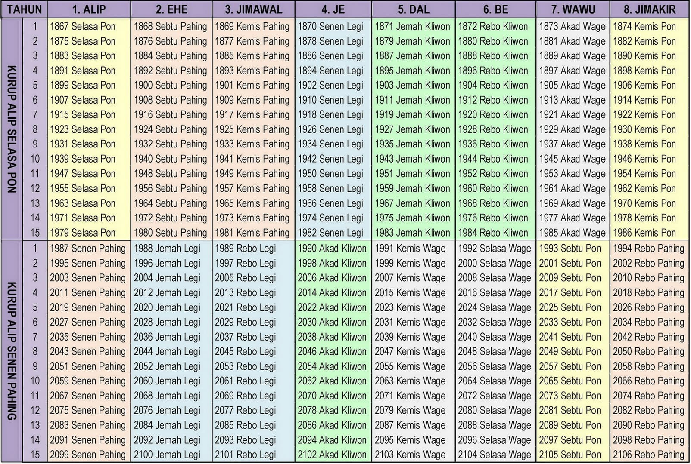
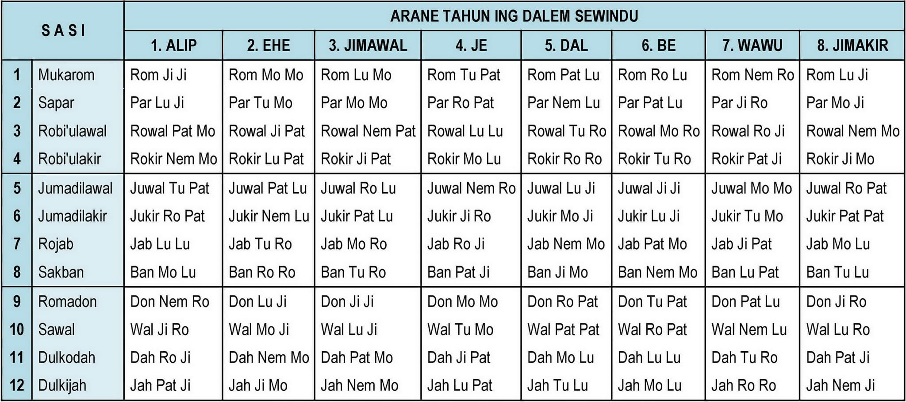

# Kalender Jawa

## Sejarah
Selain kalender umum atau Masehi yang kita gunakan saat ini, sebenarnya ada penanggalan warisan bangsa Indonesia yang sebenarnya jauh lebih akurat.
Penanggalan yang saya maksud disini adalah penanggalan jawa asli yang dibawa oleh leluhur bangsa Indonesia yang kemudian diolah oleh para wali yaitu penanggalan jawa yang dipakai sejak Raden Patah menjadi Sultan Demak pertama dimana momen ini ditandai dengan *Sengkalan* atau *Candra Sengkala*,

### *Catur Ilang Sucining Ratu*

Sengkalan tersebut menandakan tahun 1404 Saka (887 H, 1482 M) atau 4 tahun setelah runtuhnya Majapahit.

> Candra Sengkala atau Sengkalan merupakan cara orang Jawa dalam mengingat momen tahun sebagai suatu kalimat. Contoh paling terkenal adalah runtuhnya Majapahit yaitu "Sirna ilang Kertaning Bumi" atau tahun 1400 Jawa dan yang perlu menjadi catatan bahwa Sengkalan sebenarnya adalah kalender lunar yang sudah lama dipakai sebelum masa para wali [[sumber](https://www.caknun.com/2019/kalender-jowo-digowo-kalender-arab-digarap-kalender-barat-diruwat)].

## Sistematis
Berikut aturan atau sistematis utama dari Kalender Jawa yang perlu menjadi acuan:

- Kalender Jawa mempunyai siklus 8 tahunan (satu windu).
- Koreksi keberulangan terjadi setiap 120 tahun sekali (15 windu) atau istilahnya yaitu **Salin Kurup** atau **Ganti Kurup** (koreksi yaitu dengan menambah 1 hari tiap 120 tahun).

### Bulan (*Sasi*)
Jumlah bulan atau *sasi* dalam Bahasa Jawa adalah sebanyak 12 bulan dengan nama-nama sebagai berikut: 

| Urutan   |  Sasi | Alias | Jumlah Hari |
| :---: | :--- | :--- | :---: |
| 1 | Mukarom | Suro | 30 |
| 2 | Sapar | - | 29 |
| 3 | Robi'ulawal | Mulud | 30 |
| 4 | Robi'ulakir | Bakda Mulud | 29 |
| 5 | Jumadilawal | - | 30 |
| 6 | Jumadilakir | - | 29 |
| 7 | Rojab | Rejeb | 30 |
| 8 | Sakban | Ruwah, Arwah | 29 |
| 9 | Romadon | Pasa, Ramelan, Puwasa | 30 |
| 10 | Sawal | - | 29 |
| 11 | Dulkodah | Séla, Dulkangidah, Apit | 30 |
| 12 | Dulkijah | Besar | 29/30* |

***) Lihat tabel Tahun Jawa**

### Tahun Jawa
Di dalam Penanggalan Jawa Tahun bukanlah satuan kalender yang terbesar tetapi dikenal **Siklus Windu** yaitu keberulangan yang terjadi setiap 8 Tahun Jawa.

Perlu diingat bahwa konsep Tahun Jawa sangat berbeda dengan Tahun Masehi karena Tahun Jawa merupakan pembagian 8 dari siklus 120 tahun atau 8 x 15 sehingga angka tahun-tahun yang berada pada Tahun Jawa yang sama pasti mempunyai karakteristik  yang sama.  

**Tabel Nama Tahun Jawa**

| Urutan |  Tahun Jawa | hari/tahun | 
| :---: | :--- | :---: | :--- |
| 1 | Alip | 354 |
| 2 | Ehe | 355 |
| 3 | Jimawal | 354 |
| 4 | Je | 354 |
| 5 | Dal | 355 |
| 6 | Be | 354 |
| 7 | Wawu | 354 |
| 8 | Jimakir | 355 |

dan dibawah ini adalah **Tabel Hari Awal Tahun Kalender Jawa 1867‒2106 (1355‒1594 H, 1936‒2169 M)**

Seperti pada penjelasan sebelumnya tahun-tahun yang masuk di Tahun Jawa yang sama, misalnya tahun-tahun pada Tahun Be, maka semua tahun yang termasuk di Tahun Be tersebut akan mempunyai hari awal tahun yang sama yaitu **Rebo Kliwon** dan jumlah hari dalam tiap tahun juga sama yaitu sebanyak 354 hari.

## Rumus Matematis

### Rumus Hafalan Awal Bulan Kalender Jawa Abadi

 
